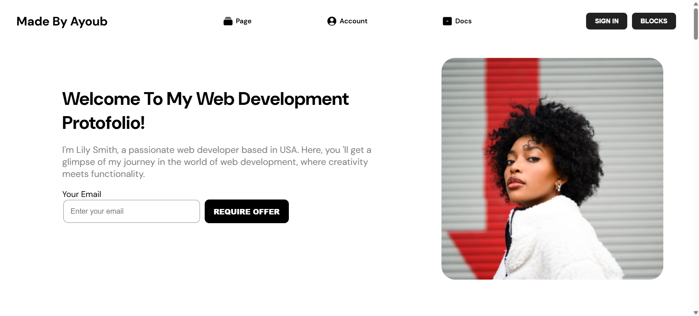

# ⚡ Digital Identity, Reimagined!


## ✨ Features
- **Unique and minimalist design** 🎨
- **Ultra-fast and smooth performance** ⚡
- **Fully responsive for all devices** 📱💻
- **Optimized for an exceptional and seamless user experience**

## 🛠️ Technologies Used
<p align="left">
  
  
  
  
</p>

## 🎯 How to Run
Wanna run this project locally? Follow these simple steps to get started in no time!

1. **Clone the repository:**  
   ```sh
   git clone https://github.com/ayoubakbartabar/profile-project.git
   ```
2. **Navigate to the project directory:**  
   ```sh
   cd MY-PROFILE-PROJECT
   ```
3. **Install dependencies:**  
   ```sh
   npm install
   ```
4. **Run the development server:**  
   ```sh
   npm run dev
   ```
### 📬 **Let's Connect & Build Something Amazing!**  

Whether you have a question, a collaboration idea, or just want to say hi—I'm always open to meaningful conversations. Let's create something extraordinary together! 🚀  

<p align="left">
  <a href="https://www.linkedin.com/in/ayoub-akbartabar-bb78b2212/" target="_blank">
    
  </a>
  <a href="https://github.com/ayoubakbartabar" target="_blank">
    
  </a>
  <a href="mailto:ayoubakbartabar1887@gmail.com" target="_blank">
    
  </a>
</p>

